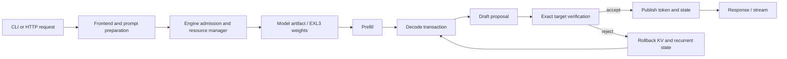

# Architecture

VoidInfer separates model semantics, resource ownership, execution, and serving. The separation is
important because a fast harness route is not automatically a supported HTTP route.

## Retained execution paths

1. The public `.ninfer` CLI/server loads an artifact, admits requests, owns contexts, and exposes
   HTTP schemas and streaming. It includes historical NVFP4/OSCAR/VeriCache development.
2. The explicit EXL3 Engine path loads target and optional draft weight directories and supports a
   narrow qualified greedy-text slice. Host-backed exact state and lifecycle rules are part of this
   path.
3. The native same-weight FP16 device-KV DFlash2 test harness is an evidence-producing research
   route. It owns frozen fixtures, exact target/state/tap/ring comparisons, and grouped wall timing.
4. Target-only and numerical/cache experiments are separate opt-in routes. A passing local gate is
   not sufficient for default promotion.

## State and ownership

The target is authoritative. Speculative work occurs inside a transaction: proposal state is
provisional, exact verification decides the accepted prefix, and rejection restores KV and GDN
recurrent state. Resource records prevent contexts, roots, or host extents from outliving their
owners. Cold and reused arms intentionally have different context-construction lifetimes, while
both retire intermediate roots and include final teardown in the recorded workload wall.

## Source map

| Area | Primary locations |
| --- | --- |
| Public API and lifecycle | `include/ninfer/engine.h`, `src/runtime/engine/` |
| CLI and server | `apps/cli/`, `apps/serve/`, `src/serve/` |
| Artifact loading | `src/artifact/`, `src/targets/` |
| EXL3 model/runtime | `src/exl3/` |
| CUDA operations | `src/ops/`, `include/ninfer/ops/` |
| KV, recurrent, and host state | `src/core/`, `src/targets/qwen3_6/impl/runtime/` |
| Exact DFlash2 authority | `tests/test_exl3_dflash2_accept.cpp`, `tests/test_exl3_real_dflash_execution.h` |
| Serving contracts | `src/serve/`, `tests/test_*schema*`, `tests/test_*http*` |

The principal tradeoff is explicit specialization: Blackwell- and model-specific code can reduce
overhead and expose ownership precisely, but it increases qualification cost and limits portability.
